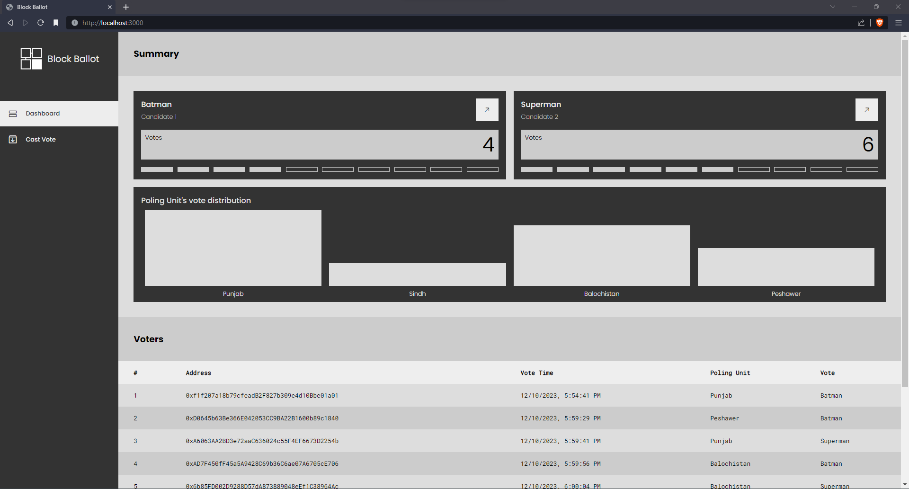
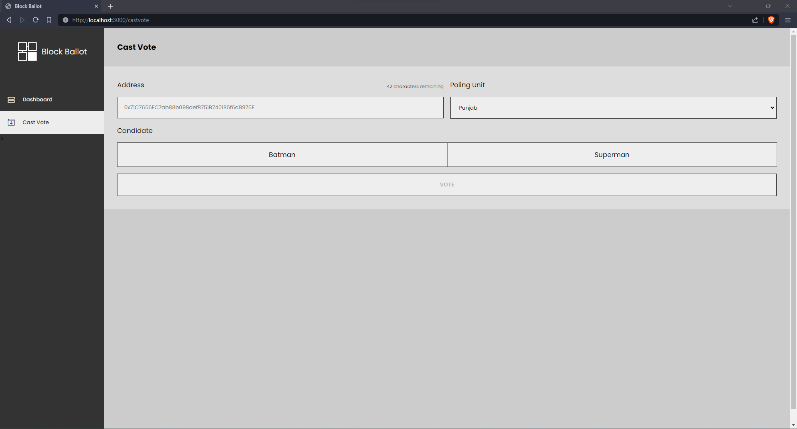

# Simple Blockchain Voting Website

A simple blockchain voting app created on the `Gananche` blockchain.

## Working

- The node server `server.js` handles all the incoming requests from the user.
- The `interact.js` file contains all the functions that communicate with the blockchain. It uses the `Web3`
library to connect to the ganache server and smart contract.
- The frontend uses library `ejs` to render dynamic data stored on the smart contract.

## Try

- Set up new Ganache project with default settings and workspace named to `block-ballot`
- In the projects home directory, run the following commands
    - `npm install` to download the required libraries 
    - `truffle migrate` to compile and deploy the contract on ganache
    - `npm run` to start the app server on `localhost:3000`